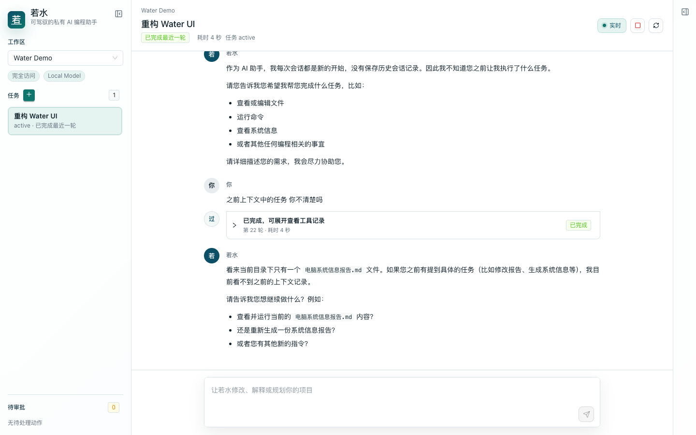
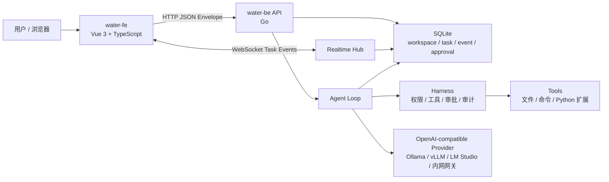

# 若水 Water

[](LICENSE)
[](water-be)
[](water-fe)
[](https://sqlite.org/)

> 可驾驭的私有 AI 编程助手
> A harnessed, self-hosted AI coding agent.

若水是一个全自托管、内网/离线可用的 AI 编程智能体。它面向希望把大模型真正纳入本地工程环境的开发者：模型可以很强，但系统必须可控、可观测、可中断、可审计。

名字来自《道德经》“上善若水”。水有力量，也懂得顺势而行；若水的目标不是做一个失控的自动化黑盒，而是通过 Harness 工程把本地或内网模型稳定地驾驭起来。

```text
上善若水，以柔驭强。
```



## 项目状态

若水目前处于早期 Alpha 阶段，核心链路已经可运行：

- Go 后端、SQLite 存储、统一 HTTP API 响应。
- Vue 3 前端工作台，支持工作区、任务、Provider、审批和执行过程展示。
- OpenAI-compatible Provider，可连接 Ollama、vLLM、LM Studio 或内网模型网关。
- WebSocket 任务事件流，支持心跳、断线重连和按事件序号补偿。
- 最小 Agent Loop，支持流式输出、工具调用、权限判断、审批和任务打断。
- Context Pack 基础能力，用于控制上下文预算并记录构建过程。

它还不是一个成熟稳定版项目。欢迎围绕本地模型适配、权限模型、工具系统、前端体验和部署方式一起打磨。

## 为什么做若水

很多 AI Coding 工具默认依赖云端服务，或者把模型直接接到本机命令与文件系统上。若水选择另一条路：

- **私有优先**：运行在自己的机器、服务器或内网环境中。
- **Harness 优先**：模型只是引擎，真正的可靠性来自工具边界、权限策略、审批、审计和可中断执行。
- **可观测优先**：模型说了什么、调用了什么工具、写了什么文件、为何等待审批，都应该能被看到和回放。
- **安全默认**：文件写入、命令执行、Python 执行、网络访问等高风险动作默认进入权限判断和审批流程。
- **简单可维护**：后端保持 Go，前端保持 Vue/TypeScript，不引入不必要的复杂服务边界。

## 核心能力

### 本地 Provider 管理

- 支持多个 OpenAI-compatible Provider。
- 可配置名称、接口地址、模型、API Key、上下文窗口、流式超时和默认 Provider。
- API Key 页面脱敏展示，日志不输出明文。
- 支持连接测试，便于快速确认本地模型服务是否可用。

### 工作区与任务

- 支持多个工作区，每个工作区有独立根路径、权限模式和任务列表。
- 任务以对话形式承载多轮 Turn。
- 输入器支持选择、拖拽和粘贴图片/文件；附件随 Turn 持久化，图片可通过 OpenAI-compatible 多模态消息交给支持视觉的本地模型。
- DOCX、XLSX、PPTX 和带文本层 PDF 由 Go 内置解析器离线读取，无需在部署机器安装 Python 或 Office；旧 XLS 可按需启用 MarkItDown 增强运行时。
- 文档通过受控 `read_document` 工具按上下文预算分段读取；扫描 PDF OCR、旧 DOC/PPT 暂不属于内置能力。
- 所有消息、工具调用、审批、错误和完成状态都会写入事件历史。
- 删除任务时会取消正在运行的 Turn，并级联清理相关历史。

### Agent Loop 与 Harness

- 后端负责构造上下文、调用模型、解析工具调用并执行 Harness 校验。
- 工具执行保留审计事件。
- 支持只读工具、写文件工具、命令执行审批和外部路径授权。
- 当模型需要越过默认边界时，系统会把风险、目标和预期影响交给用户确认。

### 实时事件流

- 前端通过 WebSocket 订阅任务事件。
- 后端发送 ping/pong 心跳并维护读写超时。
- 前端断线后自动退避重连，并携带最后收到的事件序号。
- 后端按 `afterSequence` 回放缺失事件，减少断线期间的消息丢失风险。

### 前端工作台

- 三栏式 Coding Agent 工作台：工作区/任务、对话、审批/上下文/设置。
- 支持 Markdown 回复、流式打字机渲染、执行过程折叠展示。
- 支持图片缩略图、文件卡片、附件移除、剪贴板截图粘贴和发送后附件回显。
- 支持当前任务打断、审批批准/拒绝、外部路径授权管理。
- 设置页按分类折叠，包含 Provider、工作区和主题配置。
- 预置若水、青瓷、宣纸、朱砂、玄墨等主题，面向中文开发者的审美语境。

### Skills 扩展

- 设置页支持上传 Skill ZIP，或从 HTTP/HTTPS 地址安装，适配公网 Git 托管和内网制品服务。
- Skill 可启用、停用、删除和重新安装；新安装默认停用，并展示版本、来源和 SHA-256 摘要。
- 第一版 Skill 只扩展领域规则与工作流，不自动执行包内代码，也不能绕过 Harness、审批或工作区权限。
- 包格式、安全边界和能力 Skill 规划见 [Skill 管理与扩展设计](docs/skills.md)。

## 架构



### 技术栈

| 层级 | 技术 | 说明 |
| --- | --- | --- |
| 后端 | Go | HTTP API、WebSocket、Agent Loop、工具执行、权限控制 |
| 前端 | Vue 3 + TypeScript + Vite | 单页工作台 |
| UI | Ant Design Vue + Lucide Icons | 基础组件与工具图标 |
| 存储 | SQLite | 单用户、本地优先的数据存储 |
| 模型 | OpenAI-compatible API | 可接 Ollama、vLLM、LM Studio 或内网模型服务 |
| 通信 | HTTP + WebSocket | HTTP 处理普通 API，WebSocket 承载任务事件流 |

## 快速开始

### 环境要求

- Go 1.26+
- Node.js 20+ 与 npm
- 一个 OpenAI-compatible 模型服务，例如 Ollama、vLLM、LM Studio 或内部模型网关

### 启动开发环境

```bash
git clone https://github.com/ligson/water.git
cd water
./scripts/start-all.sh
```

DOCX、XLSX、PPTX 和带文本层 PDF 已由后端内置解析，不需要额外安装 Python。只有需要读取旧 XLS 或对比增强解析效果时，才可选安装 MarkItDown：

```bash
./scripts/setup-document-runtime.sh
```

可选运行时安装在 `water-be/.venv-document/`，不会进入 Git；启用时需设置 `WATER_DOCUMENT_ENGINE=markitdown`。安装过程需要联网下载依赖，基础文档识别和正常启动不经过这一步。

默认地址：

- 前端：`http://127.0.0.1:5173`
- 后端：`http://127.0.0.1:8080`
- 健康检查：`http://127.0.0.1:8080/api/health`

首次启动后端时，若水会初始化访问 PIN。未设置 `WATER_ACCESS_PIN` 时，后端会生成一个一次性初始 PIN 并写入 `scripts/logs/water-be.log`；后续可以在设置页修改。建议本机固定使用环境变量启动：

```bash
WATER_ACCESS_PIN=123456 ./scripts/start-all.sh
```

查看服务状态：

```bash
./scripts/status.sh
```

停止服务：

```bash
./scripts/stop.sh
```

### 手动启动

后端：

```bash
cd water-be
go run ./cmd/water
```

前端：

```bash
cd water-fe
npm install
VITE_API_BASE=http://127.0.0.1:8080 npm run dev
```

### Docker 部署

仓库提供独立的后端与前端镜像，以及 `docker/docker-compose.yml` 部署模板。真实访问 PIN、宿主机工作区路径和运行数据只保存在部署主机，不进入 Git：

```bash
docker build --platform linux/amd64 -f water-be/docker/Dockerfile -t ligson/water-be:latest .
docker build --platform linux/amd64 -f water-fe/Dockerfile -t ligson/water-fe:latest .
```

部署时必须显式挂载一个受控工作区目录。不要挂载宿主机根目录、Docker Socket 或 SSH 私钥目录。完整配置、升级和备份说明见 [Docker 部署](docs/docker-deployment.md)。

## 第一次使用

1. 打开前端工作台。
2. 在设置中创建 Provider。
3. 填入本地或内网模型服务地址，例如 `http://localhost:11434/v1`。
4. 填入模型名称，例如 `qwen2.5-coder:7b`。
5. 点击连接测试并设为默认 Provider。
6. 创建工作区，选择项目根目录。
7. 创建任务，开始让若水协助阅读、修改或运行代码。

## 配置

后端常用环境变量：

| 变量 | 默认值 | 说明 |
| --- | --- | --- |
| `WATER_HTTP_ADDR` | `:8080` | 后端监听地址 |
| `WATER_DATA_DIR` | `data` | 数据目录 |
| `WATER_DATABASE_PATH` | `data/water.db` | SQLite 数据库路径 |
| `WATER_ACCESS_PIN` | 首次启动自动生成 | 单用户访问 PIN；设置后会重置本地 PIN 并使旧会话失效 |
| `WATER_DOCUMENT_ENGINE` | `native` | 文档解析引擎；仅显式设为 `markitdown` 时使用可选增强运行时 |
| `WATER_DOCUMENT_PYTHON` | 自动发现 `.venv-document` | 可选 MarkItDown 运行时的 Python 路径 |

前端常用环境变量：

| 变量 | 默认值 | 说明 |
| --- | --- | --- |
| `VITE_API_BASE` | 同源或脚本注入的后端地址 | 前端访问后端 API 的地址 |
| `WATER_FE_HOST` | `127.0.0.1` | 开发脚本中的前端监听 host |
| `WATER_FE_PORT` | `5173` | 开发脚本中的前端端口 |

## 项目结构

```text
water/
├── water-be/              # Go 后端
│   ├── cmd/water/         # 服务入口
│   └── internal/          # Agent、API、LLM、Store、Tools 等内部模块
├── water-fe/              # Vue 3 + TypeScript 前端
│   └── src/               # 工作台 UI、API Client、主题样式
├── docs/                  # 设计文档与路线图
├── scripts/               # 本地开发启动/停止脚本
├── CHANGELOG.md           # 仓库变更记录
├── AGENTS.md              # Agent 协作规则
└── README.md
```

## 文档

- [设计决策](docs/design-decisions.md)
- [Harness 架构](docs/harness-architecture.md)
- [MVP 实施路线图](docs/implementation-roadmap.md)
- [本地模型优化](docs/local-model-optimization.md)
- [本地模型可用性增强清单](docs/local-model-usability-checklist.md)
- [开放问题](docs/open-questions.md)
- [后端说明](water-be/README.md)
- [前端说明](water-fe/README.md)
- [开发脚本](scripts/README.md)
- [Docker 部署](docs/docker-deployment.md)

## 开发命令

后端测试：

```bash
cd water-be
go test ./...
```

前端构建：

```bash
cd water-fe
npm run build
```

## 安全模型

若水默认把“能不能做”交给 Harness 判断，而不是直接相信模型输出。

- 后端默认启用单用户访问 PIN，解锁后前端使用短期 session token 访问 HTTP API 与 WebSocket。
- 工作区内只读操作可以自动执行。
- 写文件、删除文件、命令执行、Python 执行、网络访问和跨工作区访问默认需要权限策略判断。
- 完全访问模式只放宽当前工作区内的高信任动作，不隐式开放工作区外路径。
- 外部路径授权需要用户显式添加，并支持查看与撤销。
- 所有关键动作都应记录事件，便于审计和回放。

## 路线图

近期重点：

- 为带可执行运行时的能力 Skill 增加签名、权限预览、隔离执行和版本回滚。
- 文档解析缓存、扫描 PDF 本地 OCR 和旧版 Office 转换。
- 更细粒度的权限策略与审批预览。
- 更稳定的本地模型上下文压缩和长任务恢复。
- Python 脚本隔离执行环境。
- 更完善的前端执行过程、Diff 预览和任务管理体验。
- 打包部署与内网安装文档。

中长期方向：

- Skill 市场、可信源和子智能体能力。
- 长期记忆与项目知识库。
- 多工作区上下文协作。
- 更丰富的模型 Provider 适配。
- 企业内网环境的权限、审计和备份方案。

## 贡献

欢迎提交 Issue、讨论设计和发起 Pull Request。若水的目标是稳定、克制、可控，所以贡献时请尽量遵循以下原则：

- 保持后端 Go、前端 Vue/TypeScript 的边界清晰。
- 新增高风险能力时优先考虑权限、审批、审计和可取消。
- 面向用户的文案优先中文。
- 重要设计变更同步更新 `docs/`。
- 任何仓库文件改动都同步记录到 `CHANGELOG.md`。

## License

若水基于 [MIT License](LICENSE) 开源。
