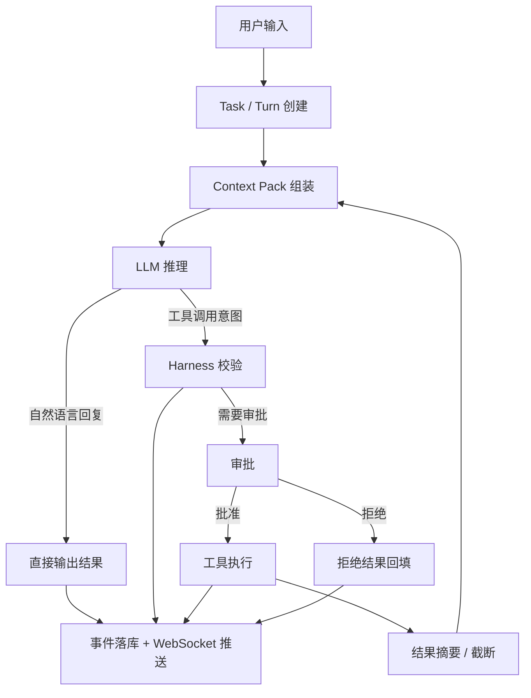

# Water Harness 设计图

本文档描述 Water 的执行骨架：任务怎么进入、上下文怎么组装、模型怎么规划、工具怎么受控执行、结果怎么回写，以及为什么这套流程不能写死成某个专用问题的分支。

## 1. 设计目标

Water 的核心不是“做一个会聊天的模型”，而是“做一个能稳定干活的执行系统”。

因此流程必须满足：

- 任何任务都走同一套 Harness。
- 模型负责提出意图，不直接执行动作。
- 工具选择由通用规划驱动，不为单一问题预制专属流程。
- 结果必须可回放、可审计、可中断。
- 本地模型能力不足时，靠上下文组织、摘要、审批和结果回填补足。

## 2. 五层结构

### 2.1 入口层

入口层只负责把一次用户提问变成一个可追踪的 Turn。

- 绑定当前 Workspace。
- 记录用户原始输入。
- 创建 Turn 与事件。
- 为后续执行分配 requestId、turnId、taskId。

### 2.2 上下文层

上下文层决定模型“看见什么”。

输入不是整个仓库，而是按优先级组装出来的 Context Pack：

1. System Rules
2. Project / Workspace Rules
3. 当前任务目标
4. 当前计划
5. 钉住的文件或说明
6. 相关文件摘要
7. 最近工具结果摘要
8. 审批与权限约束

上下文层的细节实现可参考 `docs/local-model-optimization.md`。

### 2.3 规划层

规划层只做一件事：把模型输出转成可执行意图。

支持两种来源：

- OpenAI-compatible 原生 `tool_calls`
- 约定格式 JSON

失败时不允许“猜着执行”，只能回退为文本说明或要求模型重试。

### 2.4 Harness 层

Harness 是真正的控制面。

它负责：

- 校验工具名和参数。
- 判断是否越过工作区边界。
- 判断是否需要审批。
- 判断当前权限模式是否允许执行。
- 按平台选择可用命令壳层。
- 执行后收集输出、摘要、耗时和错误。

### 2.5 观测层

观测层负责把整个过程显示给用户。

必须包括：

- 流式文本增量。
- 工具调用请求。
- 工具执行结果。
- 审批状态。
- 完成、失败、中断状态。
- 耗时展示。

## 3. Turn 生命周期

一个 Turn 的标准流程如下：

1. 用户发起任务。
2. 后端创建 Turn，并写入开始事件。
3. 组装 Context Pack。
4. 调用模型流式推理。
5. 模型输出自然语言或工具意图。
6. Harness 校验意图是否允许执行。
7. 必要时发起审批。
8. 执行工具。
9. 结果写入事件日志。
10. 结果摘要回填给模型。
11. 继续推理，直到模型收束或任务终止。

最终只会落到几种状态：

- `completed`
- `failed`
- `interrupted`
- `waiting_approval`

## 4. 为什么不能写死流程

Water 不应该有“硬编码的电脑分析报告流程”“硬编码的内存查询流程”这种分支。

原因很简单：

- 任务类型会越来越多。
- 专用分支会把系统变脆。
- 模型一旦换能力，专用逻辑就会开始漏边界。
- 通用 Harness 更容易扩展，也更符合 Codex 式设计。

正确方式是：

- 用任务目标描述用户想要什么。
- 用通用工具完成取证、写入、验证。
- 用审批和权限约束控制风险。
- 用摘要和 Context Pack 控制上下文膨胀。

## 5. 结果落盘规则

当用户要求“生成报告”“整理分析文档”“输出总结并保存”时，Water 应该默认把它当作普通的文档写入任务，而不是专门分支。

建议规则：

- 优先生成 Markdown。
- 默认保存到当前 Workspace 下的稳定路径：`reports/<任务标题>-turn-<轮次>.md`。
- 如果用户没有指定文件名，可使用任务语义生成默认文件名。
- 只有当目标路径冲突、权限不足、或用户目标不清楚时，才追问。

这样可以避免模型反复问“保存到哪里”，导致任务卡住。

## 6. 工具策略

第一版只保留少量通用工具：

- `list_dir`
- `read_file`
- `write_file`
- `run_command`

系统信息、磁盘容量、内存使用、CPU 使用率、Git 状态、测试结果等需求，优先通过通用工具和 Harness 规则解决，不新增问题专用工具。

## 7. 与 Water 当前实现的关系

Water 目前已经有：

- Workspace / Task / Turn / Event 主链路。
- WebSocket 任务事件流。
- OpenAI-compatible Provider 抽象。
- Harness 权限引擎。
- 审批流。
- Context Pack 基础能力。

这份设计的作用，是把这些能力连成一条稳定的执行链，而不是让它们各自孤立存在。

## 8. 下一步实现顺序

建议按下面顺序继续补实现：

1. 固化 Turn 状态机。
2. 补齐上下文压缩与钉住内容裁剪。
3. 规范工具意图解析和回填循环。
4. 补默认文档输出路径策略。
5. 再扩展更复杂的工具与工作流。
