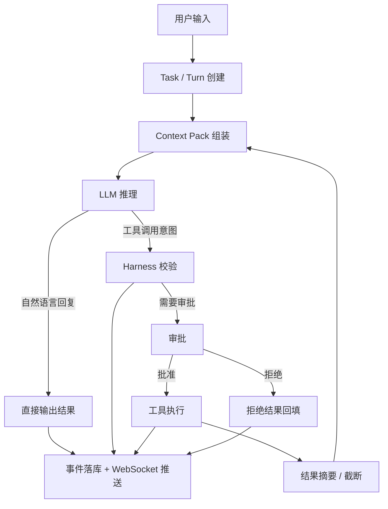

# Water Harness 设计图

本文档描述 Water 的执行骨架：任务怎么进入、上下文怎么组装、模型怎么规划、工具怎么受控执行、结果怎么回写，以及为什么这套流程不能写死成某个专用问题的分支。

## 1. 设计目标

Water 的核心不是“做一个会聊天的模型”，而是“做一个能稳定干活的执行系统”。

因此流程必须满足：

- 任何任务都走同一套 Harness。
- 模型负责提出意图，不直接执行动作。
- 工具选择由通用规划驱动，不为单一问题预制专属流程。
- 结果必须可回放、可审计、可中断。
- 本地模型能力不足时，靠上下文组织、摘要、审批和结果回填补足。

## 2. 五层结构

### 2.1 入口层

入口层只负责把一次用户提问变成一个可追踪的 Turn。

- 绑定当前 Workspace。
- 记录用户原始输入。
- 创建 Turn 与事件。
- 为后续执行分配 requestId、turnId、taskId。

### 2.2 上下文层

上下文层决定模型“看见什么”。

输入不是整个仓库，而是按优先级组装出来的 Context Pack：

1. System Rules
2. Project / Workspace Rules
3. 当前任务目标
4. 当前计划
5. 钉住的文件或说明
6. 相关文件摘要
7. 最近工具结果摘要
8. 审批与权限约束

上下文层的细节实现可参考 `docs/local-model-optimization.md`。

### 2.3 规划层

规划层只做一件事：把模型输出转成可执行意图。

支持两种来源：

- OpenAI-compatible 原生 `tool_calls`
- 约定格式 JSON

失败时不允许“猜着执行”，只能回退为文本说明或要求模型重试。

### 2.4 Harness 层

Harness 是真正的控制面。

它负责：

- 校验工具名和参数。
- 判断是否越过工作区边界。
- 判断是否需要审批。
- 判断当前权限模式是否允许执行。
- 按平台选择可用命令壳层。
- 执行后收集输出、摘要、耗时和错误。

### 2.5 观测层

观测层负责把整个过程显示给用户。

必须包括：

- 流式文本增量。
- 工具调用请求。
- 工具执行结果。
- 审批状态。
- 完成、失败、中断状态。
- 耗时展示。

## 3. Turn 生命周期

一个 Turn 的标准流程如下：

1. 用户发起任务。
2. 后端创建 Turn，并写入开始事件。
3. 组装 Context Pack。
4. 调用模型流式推理。
5. 模型输出自然语言或工具意图。
6. Harness 校验意图是否允许执行。
7. 必要时发起审批，并保存原始工具请求快照。
8. 用户批准后，Harness 用快照恢复工具调用；用户拒绝后，Turn 标记为中断。
9. 工具执行结果写入事件日志。
10. 工具结果作为 tool message 回填给模型。
11. Agent 继续推理，直到模型收束或任务终止。

最终只会落到几种状态：

- `completed`
- `blocked`
- `failed`
- `interrupted`
- `waiting_approval`

`waiting_approval` 不是最终态，而是暂停态。它必须能通过用户决策继续推进：批准后继续执行原工具调用，拒绝后写入 `turn.interrupted`，避免任务永久显示运行中。

`blocked` 是缺少外部输入时的正常终态，例如测试凭据、失败响应体、目标路径或路径授权。用户补充信息后创建新 Turn，Harness 保留原任务契约和已有证据继续推进。`interrupted` 只用于用户主动打断或运行被取消；循环保护和轮次上限不能直接伪装成完成或中断。

### 3.1 任务契约与完成裁判

每个任务由 Harness 持久化一份任务契约：

- `goal`：当前目标。
- `taskType`：普通问答、分析、排障、代码修改或文档产出。
- `stage`：理解目标、收集证据、执行修改、验证、阻塞或完成。
- `doneWhen`：可核验的完成条件。
- `missingInputs`：继续任务需要用户补充的输入。

模型不能直接写入 `completed`。当模型停止调用工具时，完成裁判器根据事件账本复核契约：代码修改必须有真实文件写入和成功验证，文档产出必须有文件写入，分析和排障必须有工具证据。完成条件不满足时继续执行；缺少外部输入时进入 `blocked`；达到运行边界仍无法满足条件时进入 `failed`。

### 3.2 假设与证据账本

任务契约回答“要做成什么”，假设与证据账本回答“当前为什么这样判断”。两者都由 Harness 持久化，不依赖模型自由总结：

- `hypotheses` 保存目标下的候选判断、状态和待补证据。
- `evidence` 保存工具来源、资源、内容 hash、摘要、支持/反证/中性结果和来源事件序号。
- 五个通用工具都接受可选 `purpose` 与 `hypothesisId`；本地模型不填写时，Harness 自动关联当前开放假设。
- 代码写入和成功验证可形成支持证据，验证失败形成反证，文件和目录读取形成中性事实证据。
- `agent.ledger.snapshot` 把当前完整账本快照送到前端；账本本身直接注入模型系统上下文，因此单轮消息压缩不会丢失当前判断。

语义无进展检测不只比较工具名和 JSON 参数。Harness 把 `read_file(path)` 与通过 `grep`、`sed`、`head`、`tail` 读取同一文件归一为相同资源，并比较文件内容 hash。同一 Turn 内：

1. 第一次相同资源与 hash 作为证据记录。
2. 第二次仍没有新信息时写入 `agent.replan.requested`，要求更换假设、资源或验证方式。
3. 第三次仍重复时触发 `semantic_no_progress`，关闭工具并强制模型基于现有证据收敛。

跨 Turn 保留历史证据，但重复计数重新开始，避免用户补充新信息后立刻被上一轮阈值拦住。任务完成后假设标记为 `resolved`；缺少外部输入时标记为 `blocked`，用户补充信息后重新打开。

## 4. 为什么不能写死流程

Water 不应该有“硬编码的电脑分析报告流程”“硬编码的内存查询流程”这种分支。

原因很简单：

- 任务类型会越来越多。
- 专用分支会把系统变脆。
- 模型一旦换能力，专用逻辑就会开始漏边界。
- 通用 Harness 更容易扩展，也更符合 Codex 式设计。

正确方式是：

- 用任务目标描述用户想要什么。
- 用通用工具完成取证、写入、验证。
- 用审批和权限约束控制风险。
- 用摘要和 Context Pack 控制上下文膨胀。

## 5. 结果落盘规则

当用户要求“生成报告”“整理分析文档”“输出总结并保存”时，Water 应该默认把它当作普通的文档写入任务，而不是专门分支。

建议规则：

- 优先生成 Markdown。
- 默认保存到当前 Workspace 下的稳定路径：`reports/<任务标题>-turn-<轮次>.md`。
- 如果用户没有指定文件名，可使用任务语义生成默认文件名。
- 只有当目标路径冲突、权限不足、或用户目标不清楚时，才追问。

这样可以避免模型反复问“保存到哪里”，导致任务卡住。

## 6. 工具策略

第一版只保留少量通用工具：

- `list_dir`
- `read_file`
- `read_document`
- `read_skill`
- `write_file`
- `run_command`

系统信息、磁盘容量、内存使用、CPU 使用率、Git 状态、测试结果等需求，优先通过通用工具和 Harness 规则解决，不新增问题专用工具。

`read_document` 是通用只读文档工具，不为某一种业务文档写死流程。Harness 先校验路径、扩展名和文件大小，再由 Go 内置解析器把 DOCX、XLSX、PPTX 和带文本层 PDF 转为文本；部署机器不需要 Python 或 Office。长内容通过 `offset` / `nextOffset` 分段进入模型上下文。旧 XLS 可显式切换到可选 MarkItDown 引擎，该模式有独立超时并禁用插件与网络 URI；扫描 PDF OCR、旧 DOC/PPT 暂不属于内置能力。

`read_skill` 用于渐进披露已启用 Skill。系统提示只常驻名称、描述和关键词目录；模型确认任务匹配后按 ID 读取完整 `SKILL.md`。停用 Skill 不能被读取，Skill 内容也不能扩大工具、审批或工作区权限。

## 7. 审批恢复

审批请求必须保存足够恢复执行的最小快照：

- 工具名。
- 工具参数。
- 工具调用 ID。
- 请求 ID。

这份快照只供后端内部恢复使用，不在审批列表里暴露给前端，避免写文件内容或命令细节在不必要的位置扩散。

用户批准后：

1. 后端写入 `approval.resolved`。
2. 后端写入 `approval.continuation.started`。
3. Harness 使用审批快照重新执行原工具调用。
4. 写入 `tool.call.started` 和 `tool.completed` 或 `tool.failed`。
5. 工具结果回填给模型继续推理。
6. 模型收束后，Harness 汇总本轮工具事件并写入 `turn.summary`。
7. 最后写入 `turn.completed`。

用户拒绝后：

1. 后端写入 `approval.resolved`。
2. 后端把当前 Turn 标记为 `interrupted`。
3. 后端写入 `turn.interrupted`，前端显示已中断。

## 8. 任务产物汇总

Codex 类产品不只展示“模型说了什么”，还会展示“实际做了什么”。Water 的任务产物卡不应该由模型自由生成，而应该由 Harness 从工具事件里归纳：

- `write_file` 汇总为已编辑文件，包含路径、创建/修改、字节数、增删行统计。
- `run_command` 汇总为命令结果；测试、构建、类型检查等命令额外归入验证结果。
- 汇总事件使用 `turn.summary`，在 `turn.completed` 之前写入，前端可在聊天流中渲染成最终产物卡。
- 第一版只做事实摘要，不做撤销和 Diff 审核；撤销/审核可以后续基于文件快照或 Git diff 扩展。

## 9. 与 Water 当前实现的关系

Water 目前已经有：

- Workspace / Task / Turn / Event 主链路。
- WebSocket 任务事件流。
- OpenAI-compatible Provider 抽象。
- Harness 权限引擎。
- 审批流。
- Context Pack 基础能力。

这份设计的作用，是把这些能力连成一条稳定的执行链，而不是让它们各自孤立存在。

## 10. 下一步实现顺序

建议按下面顺序继续补实现：

1. 增加用户可编辑的计划步骤与阶段验收。
2. 建立本地模型真实任务评测集与自动回放。
3. 补齐钉住内容裁剪和工作区符号索引。
4. 扩展更复杂的工具与工作流。

## 11. 持久化计划与阶段闸门

任务契约定义最终目标，`task_plans` 与 `task_plan_steps` 把目标拆成可逐项验收的有序执行计划。计划由 Harness 持久化和推进，模型只能看到当前主步骤，不能自行把后续步骤标成完成。

针对登录、注册和用户信息 CRUD 这类跨前后端功能，当前内置六个验收阶段：现状取证、注册、登录与 JWT、用户 CRUD、前端构建、端到端回归。每一步必须由成功工具结果提供证据；一条综合 E2E 命令可以复用同一证据连续通过它真实覆盖的相邻阶段，但不能跳过未被证明的步骤。

完成裁判在模型停止调用工具时检查计划状态。只要功能验收计划仍未完成，就返回 `plan_acceptance_not_completed` 并继续执行，避免“本轮已暂告一段落”被误当成任务完成。

遗留任务没有契约时，Harness 会从全部历史 `turn.started` 中选择范围最完整的具体目标，不再简单采用最近一次 `401`、`403` 或“继续任务”。同时，任务回放会跨 Turn 统计重复读取、失败、中断、写入、验证和 E2E 标记，为真实任务回归提供可量化基线。
