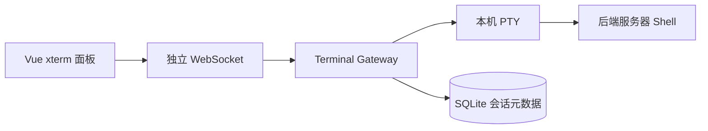

# 后端服务器终端设计

本文档描述若水（Water）的服务器终端方案。这里的“终端”不是让用户配置多个 SSH 连接，而是浏览器通过 Water 后端打开**后端进程所在服务器**上的本机 shell。

## 1. 设计目标

- 浏览器可在右侧栏打开独立终端。
- 后端通过独立 WebSocket 转发本机 PTY 输入输出。
- 终端会话绑定工作区，默认进入当前工作区根目录。
- 终端与 Agent Harness 任务事件流分离，不混入 `turn` / `tool` / `approval`。
- 第一版只做人工终端，不让 Agent 直接接管这条 shell。
- 第一版不做多连接配置，不要求用户配置主机、端口、密码或私钥。

## 2. UI 位置

终端放在前端右侧栏独立 Tab：

- 文件
- 审批
- 上下文
- 终端
- 设置

右侧栏适合辅助操作，终端可以持续滚动输出，不抢聊天主流程。聊天窗口仍只展示 Agent 对话、执行过程和任务结果。

## 3. 总体架构



浏览器只连接 Water 后端。后端在自己所在的服务器上启动 shell，并通过 PTY 与 `xterm.js` 交互。

## 4. 核心概念

### 4.1 Terminal Session

Terminal Session 是一次实际打开的后端本机 shell 会话。

字段：

- `id`
- `workspaceId`
- `status`
- `cwd`
- `cols`
- `rows`
- `createdAt`
- `updatedAt`
- `lastActiveAt`
- `closedAt`

当前数据库仍保留 `profile_id` 字段作为历史兼容实现细节。前端不暴露连接配置，创建会话时只需要 `workspaceId`、可选 `cwd` 和终端尺寸。

### 4.2 默认目录

- 用户填写 `cwd` 时，后端尝试以该路径作为 shell 工作目录。
- 用户不填写时，后端使用当前工作区根目录。
- 工作区根目录必须是后端服务器上可访问的路径。

## 5. WebSocket 协议

路径：

```text
/ws/terminal-sessions/{sessionId}
```

### 客户端消息

- `terminal.input`
- `terminal.resize`
- `terminal.close`

### 服务端消息

- `terminal.ready`
- `terminal.output`
- `terminal.exit`
- `terminal.error`
- `terminal.closed`

消息格式：

```json
{
  "type": "terminal.output",
  "sessionId": "ts_xxx",
  "requestId": "req_xxx",
  "timestamp": "2026-08-07T10:00:00+08:00",
  "payload": {
    "chunk": "..."
  }
}
```

输出内容以文本块为主，前端直接写入 `xterm.js`。

## 6. 后端职责

后端终端模块负责：

- 创建 Terminal Session 元数据。
- 启动本机 shell 与 PTY。
- 把浏览器输入写入 PTY。
- 把 PTY 输出转发到 WebSocket。
- 处理 resize、关闭和异常状态。
- 记录会话状态，便于后续审计和恢复设计。

第一版不提供 SSH Dialer，不保存 SSH 密码、私钥或远端主机配置。

## 7. 前端职责

前端终端面板使用 `@xterm/xterm`：

- 顶部显示连接状态、工作区和会话 ID。
- 提供可选会话目录输入。
- 提供连接、断开、清空、复制选中内容、重新适配尺寸按钮。
- 中部显示真实终端输出区。

前端不提供连接配置列表、主机配置、端口配置、密码或私钥输入。

## 8. 安全策略

终端是高风险通道，必须比普通任务工具更克制。

- 终端只暴露给已解锁的单用户会话。
- 终端默认操作后端服务器本机，不自动跨主机。
- 终端操作不进入 Agent Harness 的工具事件流。
- 终端会话应记录创建、关闭、异常等审计状态。
- 如果未来让 Agent 使用服务器终端，必须单独设计受控执行器和审批，不复用人工终端会话。

## 9. 当前实现状态

已落地：

- 后端创建/关闭 Terminal Session 的 HTTP API。
- 后端 `/ws/terminal-sessions/{sessionId}` 独立 WebSocket。
- 后端使用本机 PTY 启动 shell，并转发输入、输出和 resize。
- 前端右侧栏“终端”页签使用 `@xterm/xterm` 渲染交互式服务器终端。
- 前端不再展示连接配置。

暂未落地：

- 断线后的原会话重连。
- 输出缓冲与 `terminal.replay`。
- 更细粒度的终端审计与会话历史。
- Agent 受控使用服务器终端能力。
